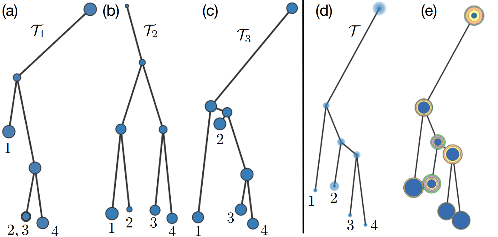

# Average Merge Tree(AMT)

This is visualization tools for calculating 1-center tree. The implementation is described in "A Structural Average of Labeled Merge Trees for Uncertainty Visualization".

# How to use

Tested with both Python 2.7 and Ubuntu 16.04.

### What to expect

You can:
- Draw trees as ensemble members in "Drawing Panel".
- Select, reconfigure and delete trees in "Ensemble Panel"
- Set related parameters and view the relation between 1-center and ensemble members in "Control Panel".
- View an animated sequence between an input tree and the 1-center via geodesic or linear strategy in "Animation".
- View vertex and edge consistency for each ensemble member, variational and statistical consistency for 1-center tree in "Consistency Visualization".

### Run
    $ virtualenv AMT-demo-env
    $ source AMT-demo-env/bin/activate
    (AMT-demo-env) $ pip install -r requirements.txt
    (AMT-demo-env) $ python app.py
    * Running on http://127.0.0.1:5000/ (Press CTRL+C to quit
    * Restarting with stat
    * Debugger is active!

### Notes

- The documents and comments are still in progress.
- Application to scalar field ensembles(refer to section 7 of above paper) will be uploaded in the following weeks.

